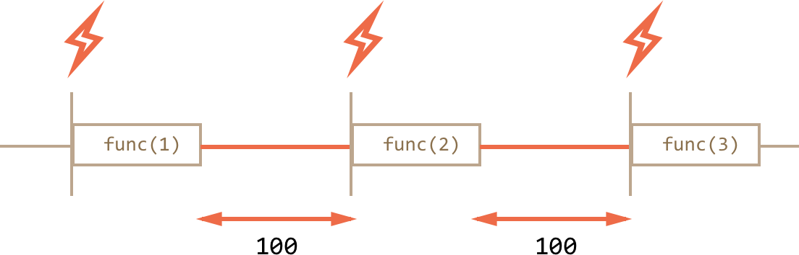

# Set Interval vs. Set Timeout to schedule some async task Problem:

There are two ways of running something regularly.
- One is setInterval.
- The other one is a recursive setTimeout, like this:


```javascript
function doSomeStuff() {
// time consuming action
}

/** instead of:
let timerId = setInterval(() => doSomeStuff(), 2000);
*/

let timerId = setTimeout(function tick() {
  doSomeStuff();
  timerId = setTimeout(tick, 2000); // (*)
}, 2000);
```

The setTimeout above schedules the next call right at the end of the current one (*).

The recursive setTimeout is a more flexible method than setInterval. This way the next call may be scheduled differently, depending on the results of the current one.

For instance, we need to write a service that sends a request to the server every 5 seconds asking for data, but in case the server is overloaded, it should increase the interval to 10, 20, 40 seconds…

Here’s the pseudocode:

```javascript
let delay = 5000;

let timerId = setTimeout(function request() {
  ...send request...

  if (request failed due to server overload) {
    // increase the interval to the next run
    delay *= 2;
  }

  timerId = setTimeout(request, delay);

}, delay);
```

And if we regularly have CPU-hungry tasks, then we can measure the time taken by the execution and plan the next call sooner or later.

Recursive setTimeout guarantees a delay between the executions, setInterval – does not.

Let’s compare two code fragments. The first one uses setInterval:

```javascript
let i = 1;
setInterval(function() {
  func(i);
}, 100);
```
The second one uses recursive setTimeout:

```javascript
let i = 1;
setTimeout(function run() {
  func(i);
  setTimeout(run, 100);
}, 100);
```

For setInterval the internal scheduler will run func(i) every 100ms:


Did you notice?

The real delay between func calls for setInterval is less than in the code!

That’s normal, because the time taken by func's execution “consumes” a part of the interval.

It is possible that func's execution turns out to be longer than we expected and takes more than 100ms.

In this case the engine waits for func to complete, then checks the scheduler and if the time is up, runs it again immediately.

In the edge case, if the function always executes longer than delay ms, then the calls will happen without a pause at all.

And here is the picture for the recursive setTimeout:



The recursive setTimeout guarantees the fixed delay (here 100ms).

That’s because a new call is planned at the end of the previous one.

# Splitting CPU-hungry tasks
There’s a trick to split CPU-hungry tasks using setTimeout.

So we can split the long text into pieces. First 100 lines, then plan another 100 lines using setTimeout(...,0), and so on.

For clarity, let’s take a simpler example for consideration. We have a function to count from 1 to 1000000000.

If you run it, the CPU will hang. For server-side JS that’s clearly noticeable, and if you are running it in-browser, then try to click other buttons on the page – you’ll see that whole JavaScript actually is paused, no other actions work until it finishes.

```javascript
let i = 0;

let start = Date.now();

function count() {

  // do a heavy job
  for (let j = 0; j < 1e9; j++) {
    i++;
  }

  alert("Done in " + (Date.now() - start) + 'ms');
}

count();
```

The browser may even show “the script takes too long” warning (but hopefully it won’t, because the number is not very big).

Let’s split the job using the nested setTimeout:

```javascript
let i = 0;

let start = Date.now();

function count() {

  // do a piece of the heavy job (*)
  do {
    i++;
  } while (i % 1e6 != 0);

  if (i == 1e9) {
    alert("Done in " + (Date.now() - start) + 'ms');
  } else {
    setTimeout(count, 0); // schedule the new call (**)
  }

}

count();
```
Now the browser UI is fully functional during the “counting” process.

We do a part of the job (*):

First run: i=1...1000000.
Second run: i=1000001..2000000.
…and so on, the while checks if i is evenly divided by 1000000.
Then the next call is scheduled in (**) if we’re not done yet.

Pauses between count executions provide just enough “breath” for the JavaScript engine to do something else, to react to other user actions.

The notable thing is that both variants – with and without splitting the job by setTimeout – are comparable in speed. There’s no much difference in the overall counting time.

To make them closer, let’s make an improvement.

We’ll move the scheduling in the beginning of the count():

```javascript
let i = 0;

let start = Date.now();

function count() {

  // move the scheduling at the beginning
  if (i < 1e9 - 1e6) {
    setTimeout(count, 0); // schedule the new call
  }

  do {
    i++;
  } while (i % 1e6 != 0);

  if (i == 1e9) {
    alert("Done in " + (Date.now() - start) + 'ms');
  }

}

count();
```

Now when we start to count() and know that we’ll need to count() more, we schedule that immediately, before doing the job.

If you run it, it’s easy to notice that it takes significantly less time.

# Summary

Nested setTimeout calls is a more flexible alternative to setInterval. Also they can guarantee the minimal time between the executions.
Zero-timeout scheduling setTimeout(...,0) is used to schedule the call “as soon as possible, but after the current code is complete”.
Some use cases of setTimeout(...,0):

To split CPU-hungry tasks into pieces, so that the script doesn’t “hang”
To let the browser do something else while the process is going on (paint the progress bar).
Please note that all scheduling methods do not guarantee the exact delay. We should not rely on that in the scheduled code.

For example, the in-browser timer may slow down for a lot of reasons:

The CPU is overloaded.
The browser tab is in the background mode.
The laptop is on battery.
All that may increase the minimal timer resolution (the minimal delay) to 300ms or even 1000ms depending on the browser and settings.

